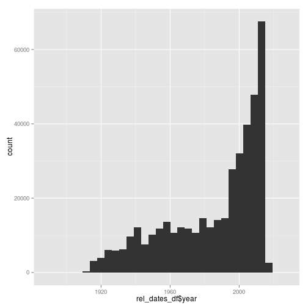

Note: This is written using Rmarkdown. You can produce HTML and Pdf documents using Rmarkdown and Rstudio. Think documentation, reports, ppt.

The dataset we will work on today is a fun dataset. IMDB Movies. Please go ahead and download the data folder in your project directory. [Download from here](https://drive.google.com/open?id=0B9NCHJOuElCGfllXSFJsd2dFWVdabEdjQVJHSmpKaUVfZUw3VTM1NFMyT0Z6dlIzSVM1MGM)

## Read the data

Common formats I know about in Biology - Flat files  - tsv, csv, txt, <some random extension of a tab delimited file>, xlsx/xls
You don't have Databases SQL, JSON etc..

###Two recommended packages 

1. `readr` and `read_xl` for readability and concise
2. `data.table::fread` for performance and consistency


```r
library(readr)
titles_df = read_csv("data/titles.csv")
cast_df = read_csv("data/cast.csv")
```

```
## 
|================================================================================| 100%  186 MB
```

```r
rel_dates_df <- read_csv("data/release_dates.csv")
```

That was easy right! 

-Please note the `<-` and `=` assignments. Lets talk! But in practical use cases choose either.
-`<<-` parent scope and `<-` local scope


```r
str(rel_dates_df)
```

```
## Classes 'tbl_df', 'tbl' and 'data.frame':	409012 obs. of  4 variables:
##  $ title  : chr  "#73, Shaanthi Nivaasa" "#AnonOccupy: Bio of a Villain" "#Beings" "#Ewankosau saranghaeyo" ...
##  $ year   : int  2007 2015 2015 2015 2014 2014 2014 2014 2015 1971 ...
##  $ country: chr  "India" "USA" "Romania" "Philippines" ...
##  $ date   : Date, format: "2007-06-15" "2015-11-05" ...
```

```r
head(rel_dates_df)
```

```
##                           title year     country       date
## 1         #73, Shaanthi Nivaasa 2007       India 2007-06-15
## 2 #AnonOccupy: Bio of a Villain 2015         USA 2015-11-05
## 3                       #Beings 2015     Romania 2015-01-29
## 4        #Ewankosau saranghaeyo 2015 Philippines 2015-01-21
## 5            #Nerealnaya lyubov 2014      Russia 2014-02-13
## 6                        #Stuck 2014      Turkey 2014-07-01
```

This is the structure command to look at meta deta for your data. We need to understand common data types in R

- Atomic Vectors
  - Boolean
  - Numeric
  
- Matrices and array ()
- Lists (trivial and common data strucure)
- Factors
- Dataframe


```r
library(ggplot2)
qplot(rel_dates_df$year)
```

```
## stat_bin: binwidth defaulted to range/30. Use 'binwidth = x' to adjust this.
```

 


